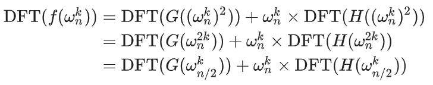
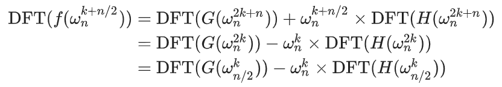

# 数学
## 多项式  
### 结论  
1. 自然数幂之和$s(n) = \sum_{i = 0}^n i^k$是关于$n$的$k+1$次多项式  


### 拉格朗日插值法  
令拉格朗日函数  
$$l_i(x) = \prod_{j \not = i}\frac{x - x_j}{x_i-x_j}$$
注意到这个函数有一些性质：  
1. 次数为$n$  
2. 在$x=x_i$位置值为$1$,$x=x_j(j\not =i)$位置值为$0$  
于是可以凑出唯一的多项式表达式为：  
$$f(x) = \sum_{i=0}^{n}y_i\prod_{j\not = i}\frac{x - x_j}{x_i-x_j}$$  
如果要取模的话得求逆元，逆元先求好分母再一起求即可。  
```cpp
int interpolation(int *x, int *y, int n) {
    int f = 0;
    for(int i = 1; i <= n; i++) {
        int s1 = 1, s2 = 1;
        for(int j = 1; j <= n; j++) {
            if(i != j) {
                s1 = 1ll * s1 * (k - x[j] + mod) % mod;
                s2 = 1ll * s2 * (x[i] - x[j] + mod) % mod;
            }
        }
        f = (f + 1ll * y[i] * s1 % mod * inv(s2) % mod) % mod;
    }
    return f;
}

```
### FFT  
蝴蝶变换：相邻的位置为二进制的reverse  
DFT变换公式：  
<!--    -->
<!--    -->
 

  
  


```cpp
#include <bits/stdc++.h>
using namespace std;
int read(){
    char c; int num, f = 1;
    while(c = getchar(),!isdigit(c)) if(c == '-') f = -1; num = c - '0';
    while(c = getchar(), isdigit(c)) num = num * 10 + c - '0';
    return f * num;
}
const int N = 3e6 + 1009;
const double Pi = acos(-1.0);
struct Complex{double x, y;}A[N], B[N];
Complex operator +(Complex a, Complex b){return (Complex){a.x + b.x, a.y + b.y};}
Complex operator -(Complex a, Complex b){return (Complex){a.x - b.x, a.y - b.y};}
Complex operator *(Complex a, Complex b){return (Complex){a.x * b.x - a.y * b.y, a.x * b.y + a.y * b.x};}
int n, m, r[N], limit = 1, len;
void FFT(Complex *A, int type){
    for(int i = 0; i < limit; i++)
        if(i < r[i])
            swap(A[i], A[r[i]]);
    for(int m = 1; m < limit; m <<= 1){
        Complex Wn = (Complex){cos(Pi / m), type * sin(Pi / m)};
        for(int i = 0; i < limit; i += 2 * m){
            Complex w = (Complex){1.0, 0};
            for(int j = 0; j < m; j++, w = w * Wn){
                Complex x = A[i + j], y = w * A[i + j + m];
                A[i + j] = x + y;
                A[i + j + m] = x - y;
            }
        }
    }
}
int main()
{
    n = read(); m = read();
    for(int i = 0; i <= n; i++) A[i].x = read();
    for(int i = 0; i <= m; i++) B[i].x = read();
    while(limit <= n + m) limit <<= 1, len++;
    for(int i = 0; i < limit; i++)
        r[i] = (r[i >> 1] >> 1) | ((i & 1) << len - 1);
    FFT(A, 1); FFT(B, 1);
    for(int i = 0; i < limit; i++)
        A[i] = A[i] * B[i];
    FFT(A, -1);
    for(int i = 0; i <= n + m; i++)
        printf("%d ", (int)(A[i].x / limit + 0.5));
    printf("\n");
    return 0;
}
```

## 群论  
### 结论  
1. **子群检验法**:群$G$是群$H$的子群的充分必要条件：对于所有元素$h$,$g$，只需检查$g^{-1} · h\in H$。

